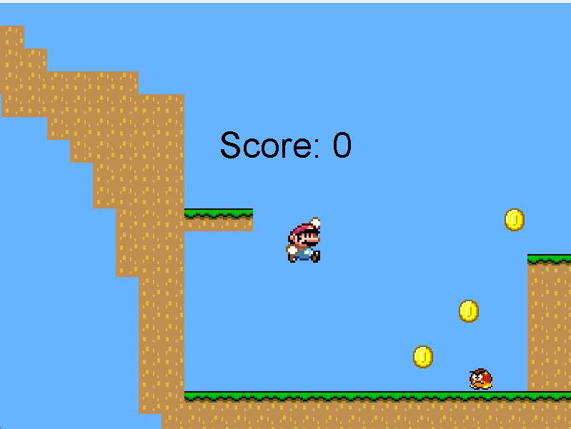
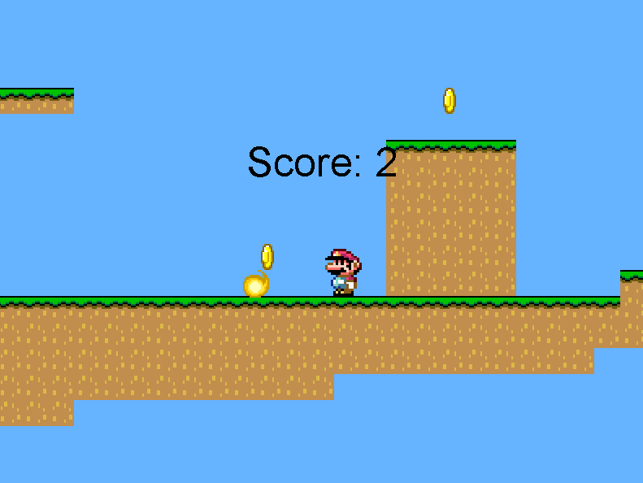
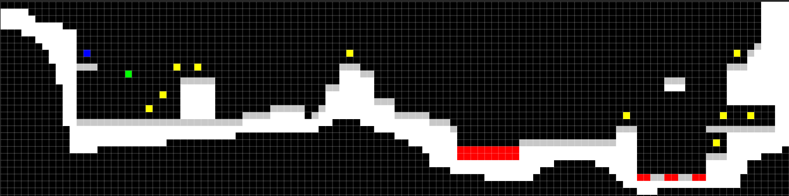

# Mario Platformer Game

---

## Introduction

Welcome! I made this 2D game because I love Mario and wanted to learn the underlying game's underlying mechanics. In this game, I have implemented features that allow for character movement, moving around the level, collecting coins, and facing off against enemies. 

## Game Mechanics and Features

- **Character Movements**: Players can move the character left, right, and have the ability to jump. The character also responds to gravity, ensuring a natural fall after a jump.
  
- **Shooting**: The character can shoot bullets (fireballs) to eliminate enemies.

  
- **Enemies**: Enemies patrol the levels and will change direction upon hitting walls. If they come into contact with a fireball, they are removed from the game.
  
- **Coins**: Throughout the levels, players can collect coins. It's a race against time and obstacles to grab as many as you can!
  
- **Levels**: The game boasts multiple levels with increasing difficulty, each presenting unique challenges and layouts.
  
- **Animations**: Smooth animations for player movements, enemy patrols, and fireball shots, enhancing the overall gaming experience.
  
- **Dynamic Camera**: A camera system that follows the player, ensuring they remain in focus and providing a broader view of the level as they move.

## Level Design

The game's level design is modular and flexible, allowing for easy addition of new levels or modification of existing ones. Each level consists of blocks (which form the terrain), coins (for players to collect), and enemies (which the player must avoid or eliminate). The layout and positioning of these elements can be easily adjusted, giving developers the freedom to create diverse and challenging environments.

## Setting Up and Running the Game

1. **Prerequisites**: Ensure you have Java and the necessary libraries installed.
  
2. **Clone the Repository**: Use `git clone [repository-link]` to clone this game repository to your local machine.
  
3. **Navigate to Source**: Change directory to the `src` folder where the main game files are located.
  
4. **Run the Game**: Execute the `Game.java` file to start the game. I used Eclipse's Java IDE to build this, so running the game in that IDE is recommended. 

Enjoy playing!

